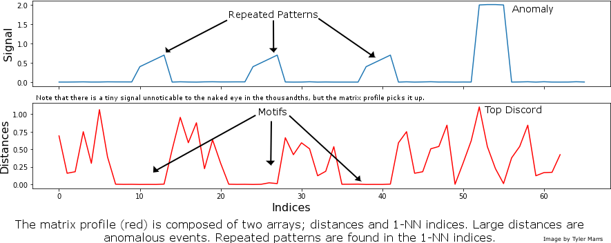
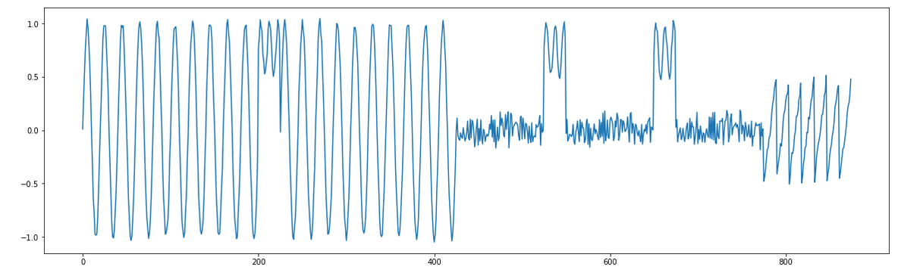
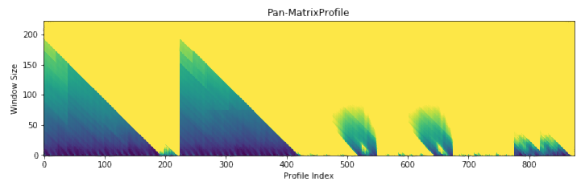

# Summary

Two fundamental tasks in time-series analysis are identifying anomalous events (“discords”) and repeated patterns (“motifs”). Successfully accomplishing these tasks is of the utmost importance across many disciplines, and can lead to powerful technological advancements, prevention of catastrophic failures and the generation of significant economic gain. While there are dozens of existing approaches for finding motifs and discords, they are hampered by a combination of steep methodological learning curves, numerous parameters that require tuning and the inability to scale across large datasets. The explosive growth of the data science community provides an additional hurdle for traditional time series analysis methods, as many practitioners lack experience in advanced mathematical and statistical principles. In this paper we present MPA (the _Matrix Profile API_) as a solution to all of these challenges. MPA is a cross-language platform in Python (_matrixprofile_), R (_tsmp_) and Golang (_go-matrixprofile_) that leverages a novel data transformation known as the Matrix Profile `[@Yeh:2016]` to rapidly identify motifs and discords. Perhaps most importantly, MPA is an easy-to-use API that’s relevant for time series novices and experts alike.

The intuition behind Matrix Profile is straightforward. It begins with a snippet of data and then slides it along the rest of the time series, calculating the overlap at each new position. More specifically, it evaluates the Euclidean distance between a subsequence and every possible time series segment of the same length, building up the snippet’s “Distance Profile.” If the subsequence repeats itself in the data, there will be at least one perfect match and the minimum Euclidean distance will be zero, or close to zero in the presence of noise. In contrast, if the subsequence is highly unique due to the presence of outliers, matches will be poor and all overlap scores will be high. Every possible snippet is slid across the time series, building up a collection of Distance Profiles. The minimum value for each time step across all distance profiles is collected, creating the time series' final Matrix Profile. Both ends of the Matrix Profile value spectrum are useful. High values indicate uncommon patterns or anomalous events; in contrast, low values highlight repeatable motifs.

The Matrix Profile scales extremely well when applied to large datasets, as demonstrated in several recent publications `[@Zhu:2017]`,`[@Gharghabi:2018]`. Its usage requires the selection of only a single parameter _k_, which is the length of the subsequence for which Euclidean distances are calculated. The recent formulation of the pan-Matrix Profile `[@Madrid:2019]` simplifies this result even further,  as it creates a global calculation of all possible subsequence lengths condensed into a single visual summary (*Figure 2*). The X-axis is the index of the matrix profile, and the Y-axis is the corresponding subsequence length. The darker the shade, the lower the Euclidean distance at that point. Thus, the pan-Matrix Profile enables truly naive exploration of any time series, which can then be examined in more detail for greater understanding.

Although the Matrix Profile can be a game-changer for time series analysis, leveraging it to produce insights is a multi-step computational process, where each step requires some level of domain experience. MPA resolves this challenge through three unique facets: an “out-of-the-box” working implementation, gentle introductions to core concepts that naturally lead into deeper exploration, and multi-language accessibility. 

To parallel the natural flow of using the Matrix Profile, MPA consists of three core API components: 1) _Compute_, which computes the Matrix Profile, 2. _Discover_, which provides methods for evaluating the MP for motifs & discords and 3. _Visualize_, which displays results through basic plots. These three capabilities are wrapped up into a high-level capability called _Analyze_, a user-friendly interface that enables individuals lacking prior knowledge about the inner workings of Matrix Profile to quickly leverage it on their own data. With a single line of code, _Analyze_ combines the pan-Matrix Profile with an under the hood algorithm to choose a pre-determined number of sensible motifs and discords from across all possible window sizes. As users gain more experience and intuition with MPA and its outputs, they can easily dive deeper into any of the three core components to make further functional gains. 

As data footprints continue to expand, the need for more robust time series methodologies will grow in lockstep. MPA provides an effective solution to this challenge that can simultanously unlock the potential of seasoned statistical veterans and brand-new data scientists across a myriad of applications.

# Acknowledgements

The authors would like to thank their fellow Matrix Foundation board members Jack Green and Frankie Cancino, as well as Eamonn Keogh, Abdullah Mueen and their numerous graduate students for creating the Matrix Profile and continuing to drive its development.

# References
